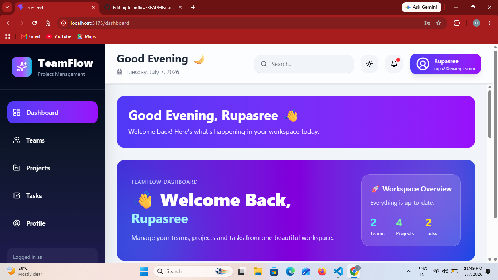
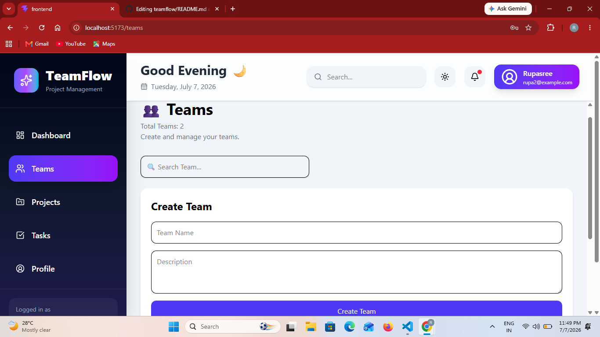
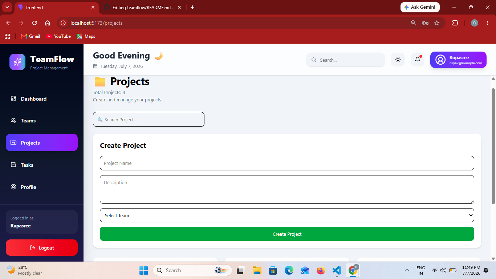
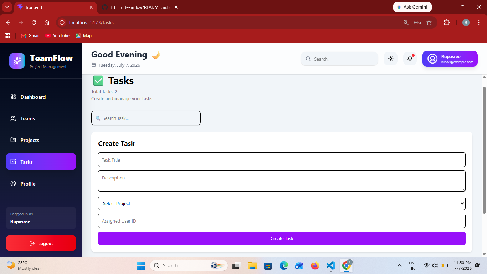
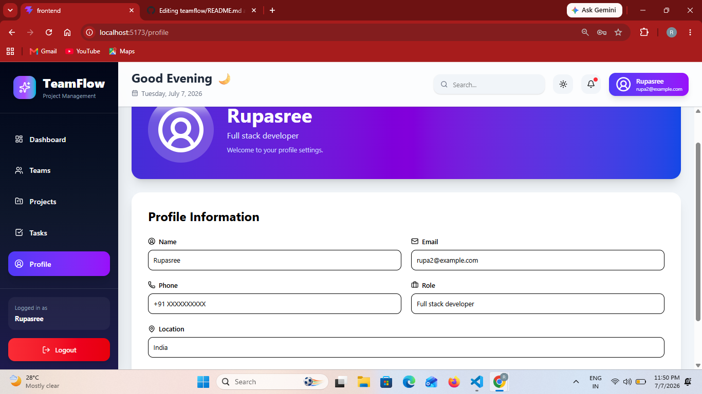

# 🚀 TeamFlow – Full Stack Project Management System

## 📌 Project Overview

TeamFlow is a Full Stack Project Management System developed to simplify the management of teams, projects, and tasks within an organization. It provides a secure authentication system, an interactive dashboard, team management, project tracking, task assignment, and user profile management through a modern web interface.

The application follows a layered architecture using React, TypeScript, Express.js, Prisma ORM, and PostgreSQL.


# 🎯 Objectives

- Build a responsive full-stack web application
- Implement secure JWT Authentication
- Perform CRUD operations
- Maintain relational data using PostgreSQL
- Develop a professional dashboard
- Consume REST APIs using Axios
- Build reusable React components


# ✨ Features

## Authentication
- Secure Login using JWT
- Protected Routes
- Logout Functionality

## Dashboard
- Total Teams
- Total Projects
- Total Tasks
- Charts
- Quick Actions
- Recent Activities

## Team Module
- Create Team
- View Teams
- Search Team
- Edit Team
- Delete Team

## Project Module
- Create Project
- Assign Team
- View Projects

## Task Module
- Create Task
- Assign Task
- View Tasks

## Profile Module
- Edit Profile
- Update Personal Information


# 🛠 Technology Stack

## Frontend

- React.js
- TypeScript
- Tailwind CSS
- React Router DOM
- Axios
- Framer Motion
- React Hot Toast
- Lucide React

## Backend

- Node.js
- Express.js
- TypeScript
- Prisma ORM
- JWT Authentication
- bcrypt

## Database

- PostgreSQL


# 🏗 System Architecture

```
React Frontend
       │
       │ Axios API Calls
       ▼
Express.js Backend
       │
       │ Prisma ORM
       ▼
PostgreSQL Database
```

---

# 📂 Folder Structure

```
TEAMFLOW

├── frontend
│   ├── src
│   │   ├── api
│   │   ├── assets
│   │   ├── components
│   │   ├── layouts
│   │   ├── pages
│   │   ├── services
│   │   └── App.tsx
│
├── backend
│   ├── prisma
│   ├── src
│   │   ├── config
│   │   ├── controllers
│   │   ├── middlewares
│   │   ├── routes
│   │   ├── services
│   │   └── server.ts
│
└── README.md
```

---

# 🗄 Database Design

### User

- id
- name
- email
- password

### Team

- id
- name
- description

### Project

- id
- name
- description
- teamId

### Task

- id
- title
- description
- priority
- status
- projectId
- assignedToId

---

# 🔗 API Endpoints

## Authentication

| Method  | Endpoint | Description |
|---------|----------|-------------|
| POST    | /login   | Login User  |

---

## Teams

| Method  | Endpoint   |
|---------|---------  -|
| GET     | /teams     |
| POST    | /teams     |
| PUT     | /teams/:id |
| DELETE  | /teams/:id |

---

## Projects

| Method  | Endpoint |
|---------|----------|
| GET     | /projects |
| POST    | /projects |

---

## Tasks

| Method    | Endpoint |
|--------  -|----------|
| GET       | /tasks    |
| POST      | /tasks     |
| PUT       | /tasks/:id |
| DELETE    | /tasks/:id |

---

# 🚀 Installation

## Clone Repository

```bash
git clone https://github.com/yourusername/teamflow.git
```

---

## Backend

```bash
cd backend
npm install
```

Create `.env`

```
DATABASE_URL=your_database_url

JWT_SECRET=your_secret_key

PORT=5000
```

Run

```bash
npm run dev
```

---

## Frontend

```bash
cd frontend

npm install

npm run dev
```

---

# 📷 Screenshots

## Login Page

## 🔐 Login


---

## 📊 Dashboard



---

## Teams



---

## Projects



---

## Tasks



---

## Profile



---

# 🔐 Authentication Flow

```
User Login
      │
      ▼
JWT Generated
      │
      ▼
Stored in Local Storage
      │
      ▼
Protected API Calls
      │
      ▼
Backend Middleware
      │
      ▼
Database Access
```

---

# 📈 Future Enhancements

- User Registration
- Role Based Access
- Notifications
- Email Verification
- File Upload
- Dark Mode
- Calendar Integration
- Team Chat
- Activity Logs

---

# 👩‍💻 Developed By

**Pothurai Rupasree**

B.Tech – Computer Science and Engineering

AI & Machine Learning Enthusiast

---

# 📚 References

- React Documentation
- Express.js Documentation
- Prisma ORM Documentation
- PostgreSQL Documentation
- Tailwind CSS Documentation
- JWT Documentation

---
# 🚀 TeamFlow

## 🌐 Live Demo

🔗 **Live Application:**  
teamflow-one-azure.vercel.app

# 🙏 Thank You

Thank you for visiting TeamFlow.

If you like this project, please ⭐ the repository.
